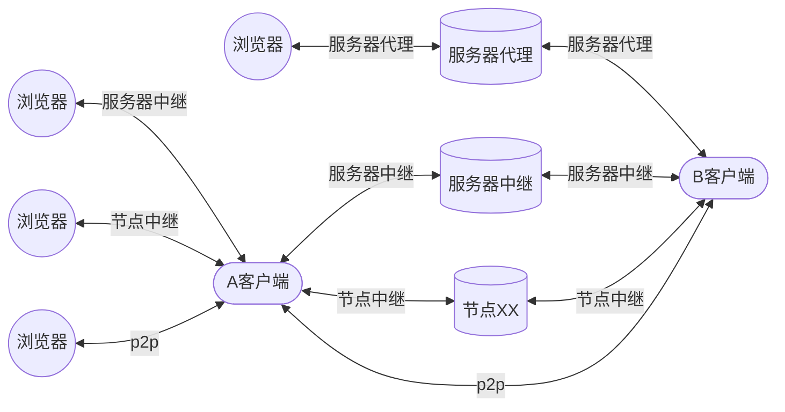

<!--
 * @Author: snltty
 * @Date: 2021-08-22 14:09:03
 * @LastEditors: snltty
 * @LastEditTime: 2022-10-23 18:41:43
 * @version: v1.0.0
 * @Descripttion: 功能说明
 * @FilePath: \client.service.ui.webd:\Desktop\p2p-tunnel\README.md
-->

# p2p-tunnel
## Visual Studio 2022 LTSC 17.3.0

1. **使用前请确保你已知其中风险，并且已做好承担风险的准备，本软件仅供学习交流，请勿用于违法犯罪**
1. **使用前请确保你已知其中风险，并且已做好承担风险的准备，本软件仅供学习交流，请勿用于违法犯罪**
1. **使用前请确保你已知其中风险，并且已做好承担风险的准备，本软件仅供学习交流，请勿用于违法犯罪**
2. 包含、tcp,udp打洞、服务器中继、节点中继、服务器代理、tun网卡组网、tcp转发、udp转发、http代理、socks5代理
3. 有任何想法，皆可进群(**1121552990**)了解
4. <a href="http://snltty.gitee.io/p2p-tunnel/" target="_blank">在线web管理端</a>，<a href="https://update7.simplix.info/UpdatePack7R2.exe" target="_blank">win7不能运行.NET6的补丁</a>
5. 用一台垃圾手机作为客户端放家里，就可以远程开机了

## 问个why？
1. A、B 任一设备在NAT后面，没有公网ipv4，没有ipv6，无法直接通信，这种情况当然需要穿透
2. A、B 一台设备有公网ipv4，一台设备有ipv6（没有ipv4公网），这时候仍然需要穿透，因为只有ipv4的一方，无法访问ipv6
3. A、B 两台设备都是ipv4，或者都是ipv6，可以直接通信（ipv4开启upnp映射，ipv6允许入栈，之类的），但如此一来，任何人都可以访问你开放的端口，并不安全，如果使用打洞，则相对安全很多

## 连个线

## 有个啥
- [x] .NET6 跨平台，小尺寸，小内存
- [x] 内网穿透 访问内网web，内网桌面，及其它TCP上层协议服务
    1. 远程桌面
    2. windows，android，ios，macOS，web <a href="https://learn.microsoft.com/zh-cn/windows-server/remote/remote-desktop-services/clients/remote-desktop-clients" target="_blank">微软rdp全家桶</a>
    3. linux <a href="https://github.com/neutrinolabs/xrdp" target="_blank">xrdp</a> 或者 <a href="https://github.com/FreeRDP/FreeRDP" target="_blank">FreeRDP</a>
- [x] p2p 打洞、tcp、udp(<a href="https://github.com/RevenantX/LiteNetLib" target="_blank">LiteNetLib rudp</a>)
- [x] 简单易用的客户端web管理页面
- [x] android app
- [x] 支持通信数据加密(预配置密钥或自动交换密钥)
- [x] 可扩展的插件式
- [x] 免费的打洞服务器
- [x] 高效的打包解包，作死的全手写序列化
- [x] 权限管理，可以只允许某些分组做某些事情
- [x] 如果你有某个节点比较牛逼，可以允许某个节点作为中继节点，节省服务器带宽
- [x] <a href="https://github.com/xjasonlyu/tun2socks" target="_blank">tun2socks</a>虚拟网卡组网，让你的多个不同内网客户端组成一个网络，通过其ip访问，更有局域网网段绑定，访问目标局域网任意设备(**暂时仅支持windows、linux、osx**)，如果无法运行虚拟网卡软件，你可能得自行下载对应系统及cpu版本的软件进行同名替换 <a href="https://github.com/xjasonlyu/tun2socks/releases" target="_blank">tun2socks下载</a>

## 介个绍
- 基础介绍 <a href="https://www.bilibili.com/video/BV1Pa411R79U/">https://www.bilibili.com/video/BV1Pa411R79U/</a>
- 联机cs1.6 <a href="https://www.bilibili.com/video/BV18d4y1u7DN/">https://www.bilibili.com/video/BV18d4y1u7DN/</a>

## 部个署
- <a href="./readme/server-linux.md">服务端 linux docker托管</a>
- <a href="./readme/client-linux.md">客户端 linux supervisor托管</a>

- 服务端docker镜像  **snltty/p2p-tunnel-server**
- 客户端端docker镜像  **snltty/p2p-tunnel-client**