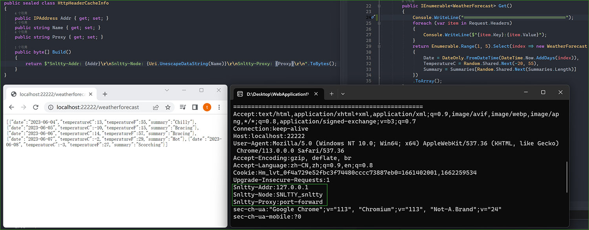

<!--
 * @Author: snltty
 * @Date: 2021-08-22 14:09:03
 * @LastEditors: snltty
 * @LastEditTime: 2022-11-21 16:36:26
 * @version: v1.0.0
 * @Descripttion: 功能说明
 * @FilePath: \client.service.ui.webd:\desktop\p2p-tunnel\README.md
-->

 

# p2p-tunnel
#### Visual Studio 2022 LTSC 17.4.1
<a href="https://jq.qq.com/?_wv=1027&k=ucoIVfz4" target="_blank">QQ 群：1121552990</a> | <a href="https://www.bilibili.com/video/BV14M4y117MB">介绍视频</a> | <a href="https://github.com/snltty/p2p-tunnel/wiki">wiki文档</a>

使用前请确保你已知其中风险

本软件仅供学习交流，请勿用于违法犯罪

## 纯属兴趣爱好
1. 这是一个内网穿透项目，包括p2p打洞穿透，服务器代理穿透，还包含了一些有趣的功能
2. 除了rudp(<a href="https://github.com/RevenantX/LiteNetLib" target="_blank">LiteNetLib</a>)，其它代码都是手写，所以代码量，内存占用率，都比较小，速度也比较快。

## 大致原理

## 一些说明
1. [x] **【内网穿透】**
    - TCP、UDP打洞，(IPV4、IPV6)(<a href="https://github.com/RevenantX/LiteNetLib" target="_blank">LiteNetLib rudp</a>)
        - A客户端<-->B客户端 <u>(p2p直连，不消耗服务器资源)</u>
    - 服务器中继
        - A客户端<-->服务器<-->B客户端 <u>(中继不参与打包解包，仅网络消耗)</u>
    - 节点中继
        - A客户端<-->某客户端(中间任意数量)<-->B客户端 <u>(中继不参与打包解包，仅网络消耗)</u>
    - 服务器代理
        - 服务器<-->A客户端 <u>(也就是通过服务器ip，或者域名，访问到内网服务)</u>
2. [x] **【.NET7】** 跨平台，高性能，小尺寸，小内存
    

3. [x] **【UI界面】** 简单易用的web管理页面
    

4. [x] **【高效】** 高效的打包解包，作死的全手写序列化，通信速度极佳，以下结果基于 CPU：i5 8400，memory：3600
    

5. [x] **【加密】** 支持通信数据加密(预配置密钥或自动交换密钥)
6. [x] **【插件式】** 可扩展的插件式
7. [x] **【自建服务器】** 自建服务器则可开启 服务器代理穿透，服务器中继
8. [x] 免费的打洞服务器
9. [ ] android app

## 内置功能
- [x] **【账号管理】** 简单的权限配置
    - [x] 到期时间
    - [x] 登入数限制(同一账号同时登入数量)
    - [x] 权限分配
    - [x] 流量限制
- [x] **【代理模块】【端口转发】** 转发tcp，udp协议，访问目标端内网服务
- [x] **【代理模块】【http代理】**  以节点或者服务端作为跳点访问外网
- [x] **【代理模块】【socks5代理】** 以节点或者服务端作为跳点访问外网
- [x] **【代理模块】【虚拟网卡组网】** 分配虚拟ip，通过ip访问目标端内网服务
    - 支持tcp、udp(支持组播，如果客户端之间是udp连接的，那将会以纯udp方式广播，不考虑是否到达，降低延迟)，方便联机游戏
    - 支持windows、linux、osx
    - 如果无法运行虚拟网卡软件，你可能得自行下载对应系统及cpu版本的软件进行同名替换 <a href="https://github.com/xjasonlyu/tun2socks/releases" target="_blank">tun2socks下载</a>

- [x] **【端口转发】，【虚拟网卡组网】以最小代价往HTTP协议添加自定义请求头**
    

## 支持作者
请作者喝一杯咖啡，使其更有精力更新代码

 
