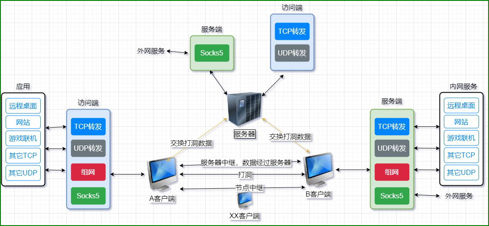
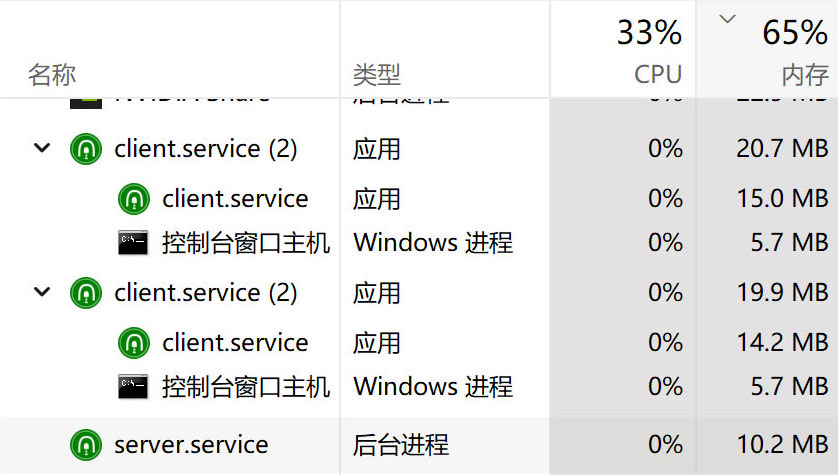
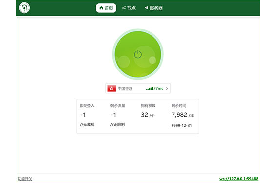

<!--
 * @Author: snltty
 * @Date: 2021-08-22 14:09:03
 * @LastEditors: snltty
 * @LastEditTime: 2022-11-21 16:36:26
 * @version: v1.0.0
 * @Descripttion: 功能说明
 * @FilePath: \client.service.ui.webd:\desktop\p2p-tunnel\README.md
-->

 

# p2p-tunnel
#### Visual Studio 2022 LTSC 17.4.1
<a href="https://jq.qq.com/?_wv=1027&k=ucoIVfz4" target="_blank">QQ 群：1121552990</a> | <a href="https://www.bilibili.com/video/BV14M4y117MB">介绍视频</a>

使用前请确保你已知其中风险

本软件仅供学习交流，请勿用于违法犯罪

## 由来理念
1. 这是一个内网穿透项目，包括p2p打洞穿透，服务器代理穿透，还包含了一些有趣的功能
2. 之前用了一些穿透工具，存在一些问题
    1. 有go的，rust的，c++的，都看不太懂，不好加自己需要的功能
    2. .NET平台的极少，且，或仅支持服务器代理穿透，或内存占用量非常大(100MB+)，都不是很符合自己的期望
3. 基于这些有的没的，就决定了自己实现，做一个自己喜欢的内网穿透工具，也是为了学习网络协议相关知识
4. 除了rudp(<a href="https://github.com/RevenantX/LiteNetLib" target="_blank">LiteNetLib</a>)，其它代码都是手写，所以代码量，内存占用率，都比较小，速度也比较快。

## 大致的原理

## 一些说明
1. [x] **【内网穿透】**
    - TCP、UDP打洞，(<a href="https://github.com/RevenantX/LiteNetLib" target="_blank">LiteNetLib rudp</a>)
        - A客户端<-->B客户端
    - 服务器中继
        - A客户端<-->服务器<-->B客户端
        - 中继不参与打包解包，仅网络消耗
    - 节点中继
        - A客户端<-->某客户端(中间任意数量)<-->B客户端
        - 中继不参与打包解包，仅网络消耗
    - 服务器代理
        - 服务器<-->A客户端
2. [x] **【.NET7】** 跨平台，高性能，小尺寸，小内存

3. [x] **【UI界面】** 简单易用的web管理页面

4. [x] **【高效】** 高效的打包解包，作死的全手写序列化，通信速度极佳，iperf3 原端口5201，和经过tcp转发的 11111 端口的测试结果

5. [x] **【加密】** 支持通信数据加密(预配置密钥或自动交换密钥)
6. [x] **【插件式】** 可扩展的插件式
7. [x] **【自建服务器】** 自建服务器则可开启 服务器代理穿透，服务器中继
8. [x] 免费的打洞服务器
9. [ ] android app

## 内置功能
- [x] **【账号管理】** 简单的权限配置
    - [x] 到期时间
    - [x] 登入数限制(同一账号同时登入数量)
    - [x] 权限分配
    - [ ] 流量限制
- [x] **【tcp转发】** 转发tcp协议
    - (访问端,访问127.0.0.1:11111) <----> A客户端(监听11111端口) <--打洞/服务器中继/节点中继--> B客户端<----> 内网服务(8088端口)
- [x] **【udp转发】** 转发udp协议
    - (访问端,访问127.0.0.1:11111) <----> A客户端(监听11111端口) <--打洞/服务器中继/节点中继--> B客户端<----> 内网服务(8088端口)
- [x] **【http代理】**  以节点或者服务端作为代理目标
    - (访问端,访问www.domain.com) <----> A客户端 <--打洞/服务器中继/节点中继--> B客户端 <----> 外网服务(www.domain.com)
    - (访问端,访问www.domain.com) <----> A客户端 <----> 服务器 <----> 外网服务(www.domain.com)
- [x] **【socks5代理】** 以节点或者服务端作为代理目标
    - (访问端,访问www.domain.com) <----> A客户端 <--打洞/服务器中继/节点中继--> B客户端 <----> 外网服务(www.domain.com)
    - (访问端,访问www.domain.com) <----> A客户端 <----> 服务器 <----> 外网服务(www.domain.com)
- [x] **【虚拟网卡组网】** 
    - (访问端,访问192.168.54.2:8088) <----> A客户端(192.168.54.1) <--打洞/服务器中继/节点中继--> B客户端(192.168.54.2)<----> 内网服务(8088端口)
    - <a href="https://github.com/xjasonlyu/tun2socks" target="_blank">tun2socks</a>虚拟网卡组网，让你的多个不同内网客户端组成一个网络，通过其ip访问，更有局域网网段绑定，访问目标局域网任意设备(**暂时仅支持windows、linux、osx**)，如果无法运行虚拟网卡软件，你可能得自行下载对应系统及cpu版本的软件进行同名替换 <a href="https://github.com/xjasonlyu/tun2socks/releases" target="_blank">tun2socks下载</a>

## 部署运行
#### windows 可使用托盘程序
- client.service.tray.exe    //客户端
- server.service.tray.exe    //服务端

#### linux 按你喜欢的方式进行托管
- <a href="./readme/server-linux.md">服务端 linux docker托管</a>
- <a href="./readme/client-linux.md">客户端 linux supervisor托管</a>
- 服务端docker镜像  **snltty/p2p-tunnel-server**
- 客户端端docker镜像  **snltty/p2p-tunnel-client**

## 支持作者
请作者喝一杯咖啡，使其更有精力更新代码

 
