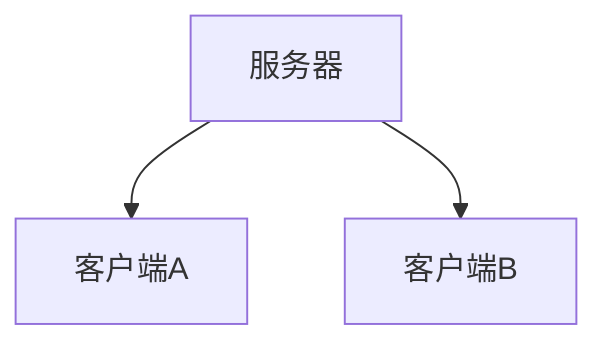
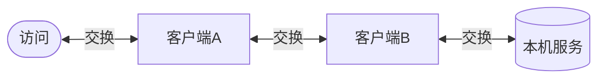
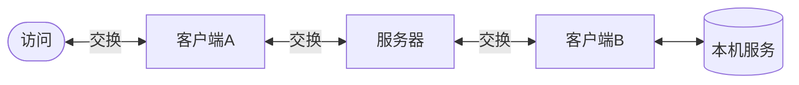
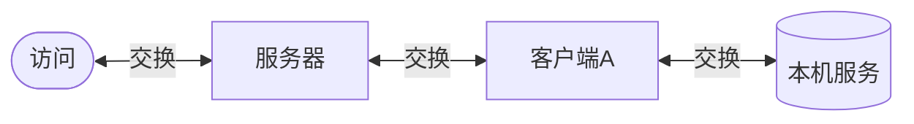

<!--
 * @Author: snltty
 * @Date: 2022-08-28 13:00:03
 * @LastEditors: snltty
 * @LastEditTime: 2022-08-28 14:40:37
 * @version: v1.0.0
 * @Descripttion: 功能说明
 * @FilePath: \打洞系列视频\概念.md
-->
# 1、所需

# 2、打洞
打洞的方式
>运气好的话，可以打洞成功，则两个客户端之间可以直接连接通信

优点：1、延迟小。2、不依赖服务器带宽。3、相对安全

缺点：1、打洞成功率并不高。2、需要访问端也注册比较麻烦

# 3、中继（默认服务器不开启）
服务器中继的方式，在功能使用上，与打洞的使用方式一致
>运气不好，你所在的网络管理比较严格，客户端之间无法直接连接通信，则如果服务器配置了支持中继，则会退化到中继方式

优点：1、打洞退化，在打洞失败时自动退化。2、相对安全

缺点：1、需要访问端也注册比较麻烦。2、服务器压力也大。3、 延迟也较大

# 4、服务器代理（默认服务器不开启）
服务器代理的方式
> 服务器代理方式则只需要在被访问端注册，访问端则不需要，比较适合随时随地访问，只是比较废服务器

优点：1、只需要注册被访问端，访问端随时随地

缺点：1、相对不太安全（需要服务器开放端口）。2、废服务器，如果是多人使用，则服务器压力较大。3、延迟也比较大
