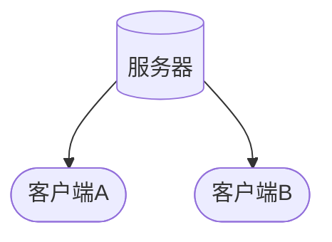

<!--
 * @Author: snltty
 * @Date: 2022-09-17 23:33:44
 * @LastEditors: snltty
 * @LastEditTime: 2022-09-18 00:42:47
 * @version: v1.0.0
 * @Descripttion: 功能说明
 * @FilePath: \readme\2.1、打洞、udp.md
-->
# 1、所需


# 主要原理（理想情况下）
1. B 向 A 随便发一个数据，不管数据是否能够到达A，网关都可能会建立一条映射，
2. A 向 B 发送数据，因为之前B端网关建立的映射，此时，A的数据可以通过B的网关
3. 后续两边就可以通信了

# 步骤

### 1、注册
1. **【客户端A】** 向服务器注册，得到 **注册通道**
2. **【客户端B】** 向服务器注册，得到 **注册通道**

### 2、打洞
假设 **【客户端A】** 主动发起打洞

1. **【客户端A】** 新建**监听**（随便一个端口，比如555），然后用这个 **监听对象** 向服务器随便发送一个数据（udp可以直接发送，无需连接），获取到本次的 **【客户端A】** 外网端口（比如说556），和外网IP，比如x1.x1.x1.x1
    > 服务器保存数据 【客户端A】:{num:1,port:556,ip:x1.x1.x1.x1}
    ```mermaid
    flowchart LR
    id1([客户端A]) <--可以啥都不带-->id5[(服务器)]
    ```
2. **【客户端A】** 通过 **注册通道** 通知 **【客户端B】**
    > 编号1---->服务器（服务器根据1，获取端口和ip，在一起发送）----->客户端B（得到数据 【客户端A】:{num:1,port:556,ip:x1.x1.x1.x1}）
        > 服务器保存数据 【客户端A】:{num:1,port:556,ip:x1.x1.x1.x1}
    ```mermaid
    flowchart LR
    id1([客户端A]) <--编号1-->id5[(服务器)] <--编号+端口+ip--> id2([客户端B])
    ```

3. **【客户端B】** 新建**监听**（随便一个端口，比如666），然后用这个 **监听对象** 向服务器随便发送一个数据（udp可以直接发送，无需连接），获取到本次的 **【客户端B】** 外网端口（比如说667），和外网IP，比如x2.x2.x2.x2
    > 服务器保存数据 【客户端B】:{num:1,port:667,ip:x2.x2.x2.x2}
    ```mermaid
    flowchart LR
    id1([客户端B]) <--带上编号1-->id5[(服务器)]
    ```

4. **【客户端B】** 新建完后， 通过 **监听对象** 随便给 **【客户端A】** x1.x1.x1.x1:556 发送点数据
    ```mermaid
    flowchart LR
    id1([客户端B]) <--随便发点啥--> id2([客户端:Ax1.x1.x1.x1:556])
    ```

5. **【客户端B】** 通过 **注册通道** 通知 **【客户端A】**
    ```mermaid
    flowchart LR
    id1([客户端B]) <--编号1-->id5[(服务器)] <--编号+端口+ip--> id2([客户端A])
    ```

6. 此时 **【客户端A】** 通过 **监听对象** 给 **【客户端B】** x2.x2.x2.x2:667 发送数据
    ```mermaid
    flowchart LR
    id1([客户端A]) <--直接发送数据--> id2([客户端B:x2.x2.x2.x2:667])
    ```

7. 后续就没服务器什么事儿了， 只要两边确认收到数据了，就说明打洞成功了