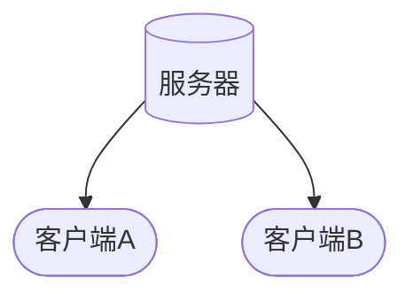

<!--
 * @Author: snltty
 * @Date: 2022-09-19 09:30:11
 * @LastEditors: snltty
 * @LastEditTime: 2022-09-19 10:00:59
 * @version: v1.0.0
 * @Descripttion: 功能说明
 * @FilePath: \readme\3、穿透2、中继.md
-->
# 1、所需

# 通信流程

# 实现步骤

### 1、注册
1. **【客户端A】** 向服务器注册，得到 **注册通道**
2. **【客户端B】** 向服务器注册，得到 **注册通道**

### 2、中继
1. A向B打洞，打洞失败
2. A 克隆 **注册通道** 或者新建一个连接到服务器的通道，作为 **中继通道**
3. A 通知 B，我要使用中继模式，则B也同样，克隆 **注册通道** 或者新建一个连接到服务器的通道，作为 **中继通道**
4. 后续A,B之间通信使用 **中继通道**