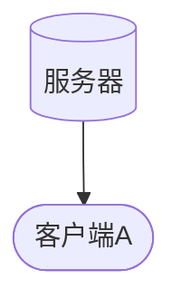

# 1、所需

# 通信流程

# 实现步骤

### 1、注册
1. **【客户端A】** 向服务器注册，得到 **注册通道**

### 2、代理

1. **服务器** 监听一个端口，比如 8000
2. **【客户端A】** 注册后，向服务器申请一个域名，比如 a.xxx.com，(当然，这个域名事先已经做好解析)，并且，我的本地地址是 127.0.0.1:80
    >服务端保存  a.xxx.com:{name:'【客户端A】',ip:'127.0.0.1',port:80} 这样一个数据
3. 当有人浏览器访问 a.xxx.com:8000，服务器根据 http的请求头host，获取到 a.xxx.com这个值，加以判断
    >得到 {name:'【客户端A】',ip:'127.0.0.1',port:80}
4. 服务器将这些数据发送给 **【客户端A】**，httpData就是http的请求数据
    >大概是这样  {ip:'127.0.0.1',port:80,data:httpData}  

5. **【客户端A】** 收到后，去链接 **127.0.0.1:80**，然后将 httpData发送过去，再等待 **127.0.0.0:80** 的回复，再返回给服务端，服务端返回给访问端

6. 完成一次通信