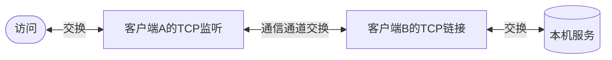

<!--
 * @Author: snltty
 * @Date: 2022-09-19 09:30:11
 * @LastEditors: snltty
 * @LastEditTime: 2022-09-19 10:26:30
 * @version: v1.0.0
 * @Descripttion: 功能说明
 * @FilePath: \readme\5、通信1、tcp转发.md
-->
# 通信通道
1. 不管是 打洞 或者 中继，统一称之为 **通信通道**

# 通信流程

# 实现步骤
1. **通信通道** 正常可使用
2. **【客户端A】** 监听端口 12345
    >保存一条数据  127.0.0.1:{target:'【客户端B】',ip:127.0.0.1,port:80}
    
    >或者  my.xxx.com:{target:'【客户端B】',ip:127.0.0.1,port:80}
    
    > 127.0.0.1 或 my.xxx.com 为http请求的host
3. 浏览器访问 127.0.0.1:12345，监听收到http数据，获取到请求头host 为 127.0.0.1，加以判断，得到数据
    > {target:'【客户端B】',ip:127.0.0.1,port:80}

4. 组织出数据包，通过 **通信通道** 发送给 **【客户端B】**，httpData就是请求的http数据
    >像这样 {ip:127.0.0.1,port:80,data:httpData}

5. **【客户端B】** 收到数据，socket去连接 127.0.0.1:80，将httpData发送过去，然后等待回复，再将回复数据通过 **通信通道** 返回去，**【客户端A】** 再将数据返回给访问端

6. 完成一次通信